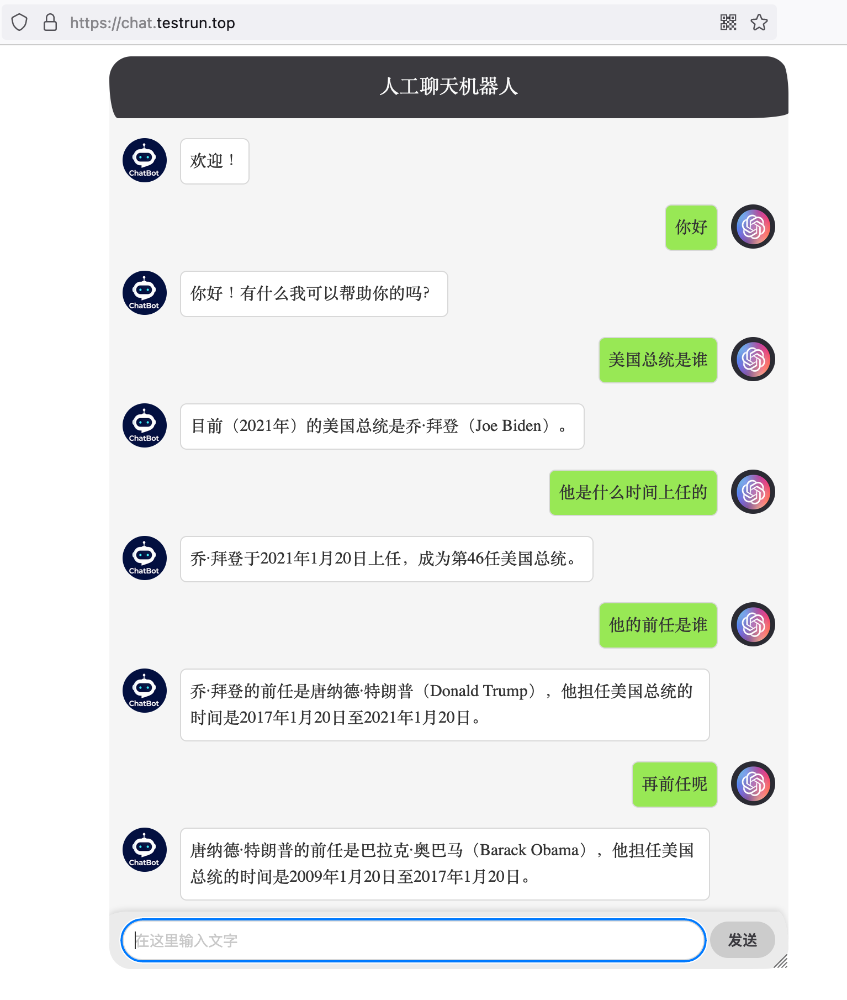

# Build and Deploy OpenAI-powered Chatbot

**You can follow this guide to quickly setup a web-based Chatbot,  powered by OpenAI, on GCP Cloud Run or your local machine**



**As a prerequisite, you need to have an OpenAI account, and obtain a API key.**

## Manual deployment on GCP Cloud Run

### 1. Store your API key in Secrets Manager
```
apikey="paster_your_api_key"
secretId=openai-apikey
echo -n $apikey | gcloud secrets create $secretId --data-file=-

```
Grant your default compute service account permission to access the secret
```
projectNumber=$(gcloud projects list --format='value(projectNumber)' --filter="projectId=$(gcloud config get-value project)")

gcloud secrets add-iam-policy-binding $secretId \
    --member="serviceAccount:$projectNumber-compute@developer.gserviceaccount.com" \
    --role="roles/secretmanager.secretAccessor"
```

### 2. Download git repo
```
git clone https://github.com/hxhwing/openai-chatbot.git
cd openai-chat
```

### 3. Run gcloud to build and deploy Cloud Run service interactively
```
gcloud run deploy \
--update-secrets=api_key=${secretId}:latest \
--allow-unauthenticated \
--region=us-central1
```

This will automatically build container image from source, and interactively deploy your web service to Cloud Run


**After deployment completion, browse Cloud Run Service URL to access the Chatbot.**


## Test on local machine

### 1. Download git repo
```
git clone https://github.com/hxhwing/openai-chatbot.git
cd openai-chatbot
```

### 2. Install required dependencies
```
pip3 install -r requirements.txt
```

### 3. Setup API key in Environment Variable
```
export api_key="paster_your_api_key"
```

### 4. Run Chatbot web service locally
```
python3 -m flask --app main.py run
```

**Browse http://127.0.0.1:5000 to access to Chatbot**
```
➜  openai-chatbot git:(main) python3 -m flask --app main.py run
 * Serving Flask app 'main.py'
 * Debug mode: off
WARNING: This is a development server. Do not use it in a production deployment. Use a production WSGI server instead.
 * Running on http://127.0.0.1:5000
Press CTRL+C to quit
```